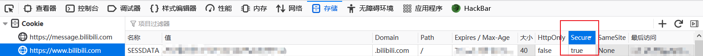

# download_bilibili_video_to_audio

【B站听歌】下载B站“稍后再看”中的视频，保存并转换为为MP3格式

很多好听的歌只在B站找得到资源，音乐APP上没有，为了能够更方便的听歌，写了这个工具，可以将放在“稍后再看”中的视频下载下来，并且转换为MP3格式

## 使用方法

### 0x01 获取B站Cookie

浏览器打开`https://www.bilibili.com/`并且登录账号

进入`F12 --> 存储 --> https://www.bilibili.com`，找到`SESSDATA`，这个是维持B站登录状态的Cookie，将他的`Secure`属性改为`false`，这样后面才能通过JS获取到



进入`F12 --> 控制台`，输入以下命令，获取到所有Cookie

```js
console.log(document.cookie)
```

获取完Cookie记得将`SESSDATA`的`Secure`属性改回`true`，否则可能会有安全问题

> 目前只能这样获取Cookie，非常麻烦，以后可能会想出更好的解决方案

### 0x02 填写配置

```py
# B站的Cookie
COOKIE = "key1=value1; key2=value2; keyn=valuen"
# 视频存放位置（绝对路径）
VIDEO_PATH = "C:\\download_bilibili_video_to_audio\\videos"
# 音频存放位置（绝对路径）
MUSIC_PATH = "C:\\download_bilibili_video_to_audio\\musics"
```

### 0x03 运行

```cmd
python bilibili.py
```